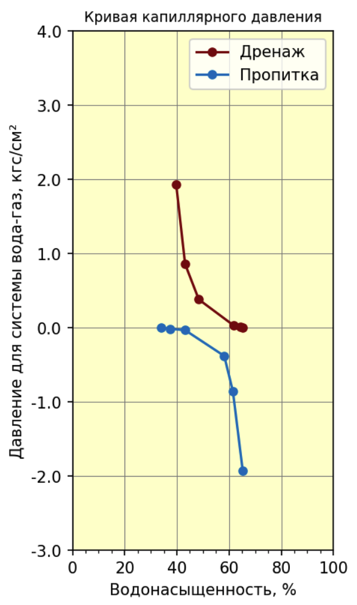
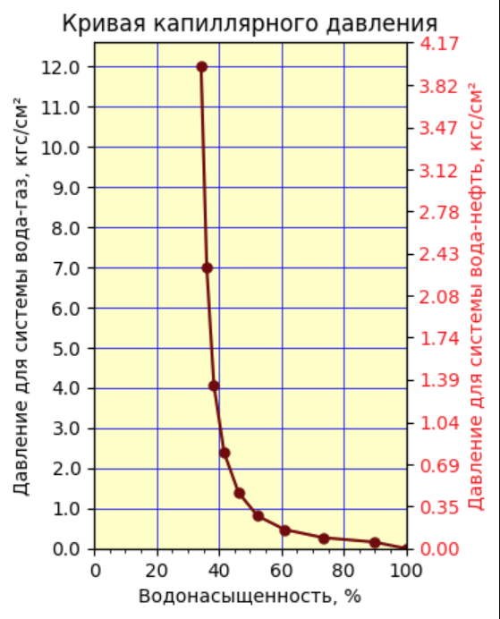
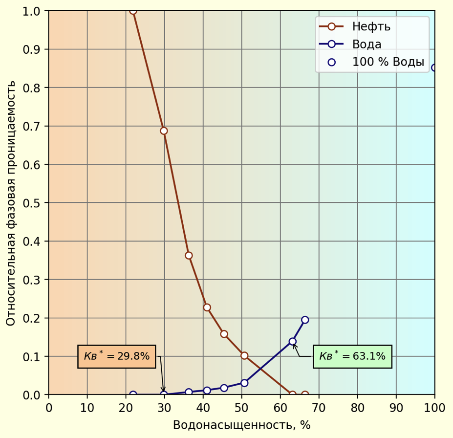
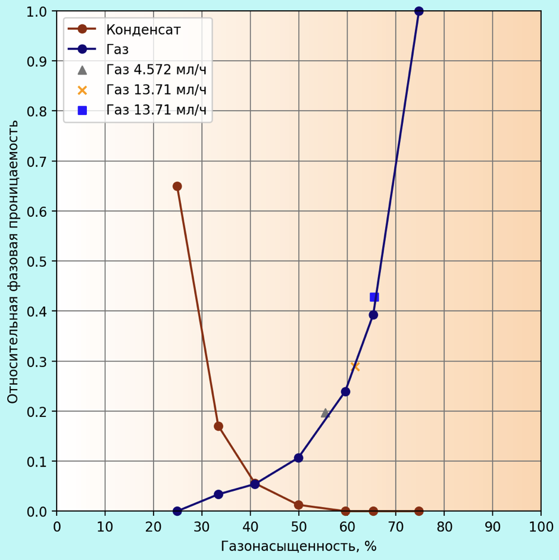
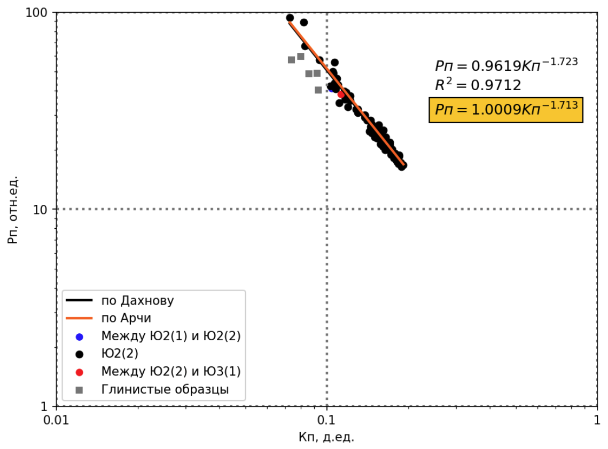
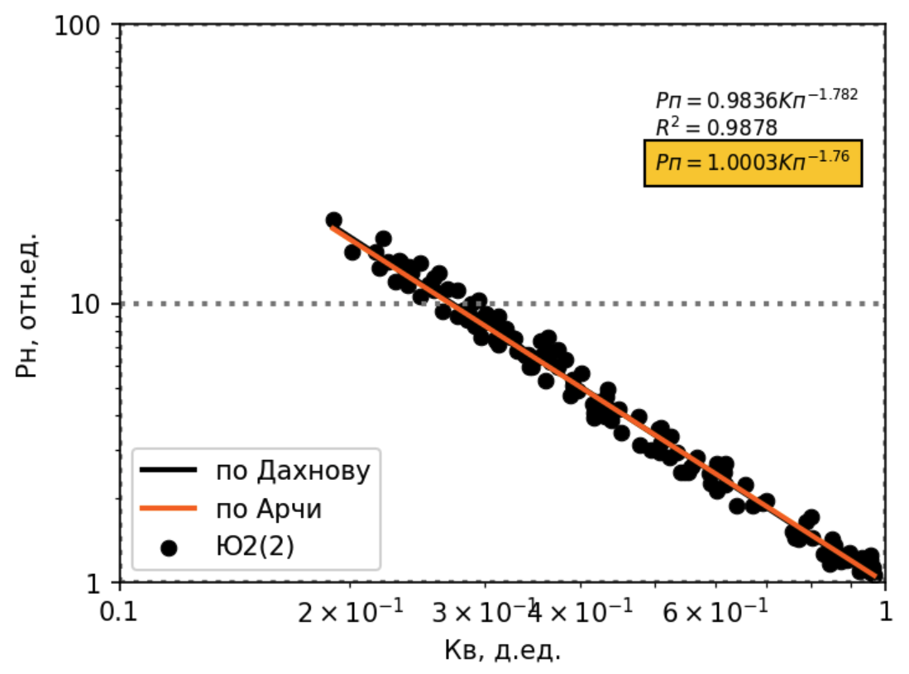
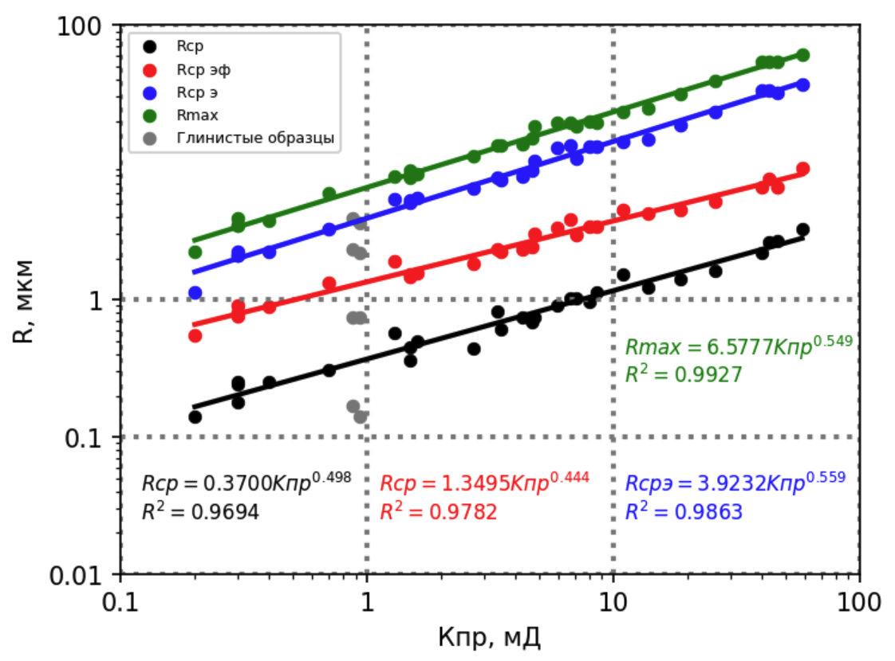
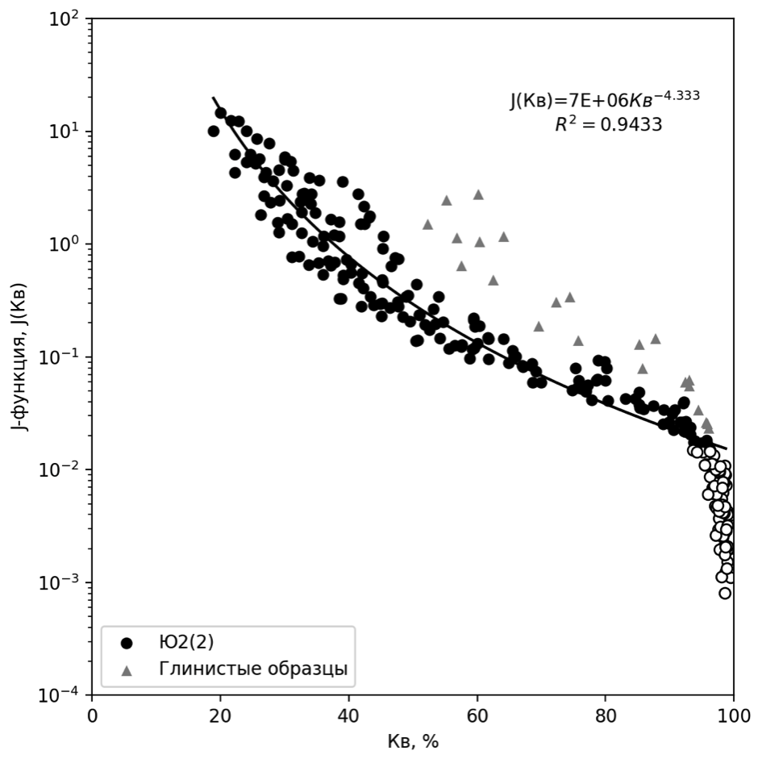
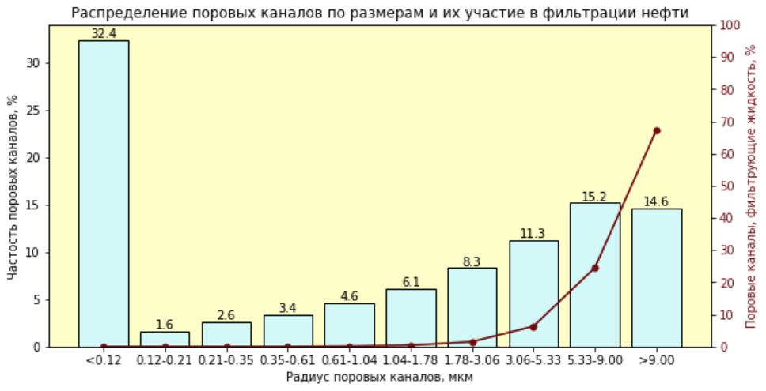
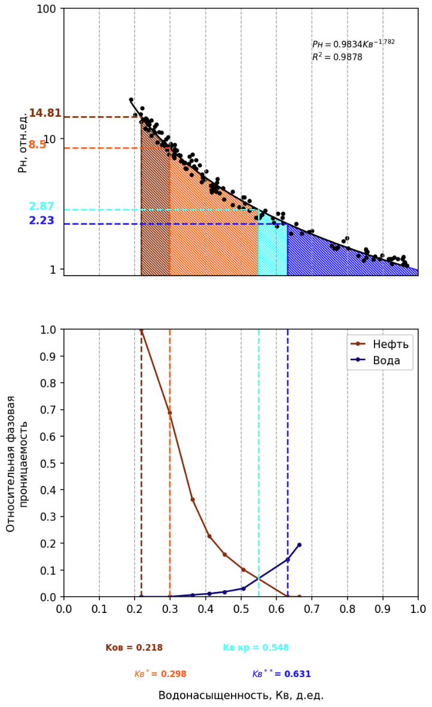

# charts
Собрал примеры графиков, которые сделал на прошлом месте работы. Некоторые были действительно интересные. Для построения этих графиков использовал только matplotlib, seaborn. Для вычислений pandas, numpy.

Первые графики насыщений, работа с сетками, дополнительными осями. Не особо сложные графики

  
  

Далее интересные графики с градиентом на фоне. И на первом есть пометки на графике

  
  

Дальше группа графиков, на которых нужно было найти зависимость. Она бывала разного вида: степенная, логарифмическая, просто линейная, квадратичная зависимость. В этом мне помог numpy.
Особенно интересен последний график. Нужно было определить threshold по которому отсекать поиск зависимости (монотонные участвуют в поиске, "пустые" - нет).

  
  
  
  

Ну и ещё пару красивых графиков

